# Customization

This page will explain all configuration available and how to edit each section appear on theme. Let's view the first homepage.

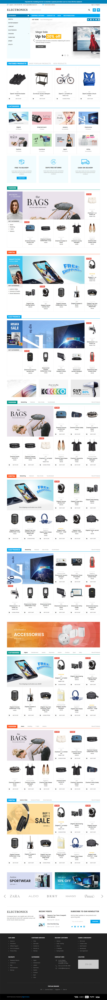


## Top Banner

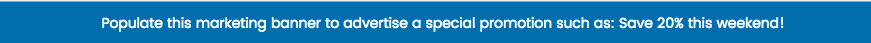

The top banner can be showed / edited in admin page > __Marketing__ > __Banners__. When you add / edit remember to choose __Location__ is __Top of Page__.

### Colors Customization

To customize colors of this section, go to admin page > __Storefront Design__ > __My Themes__, click button __Customize__ of the current theme to open the Theme Editor. 

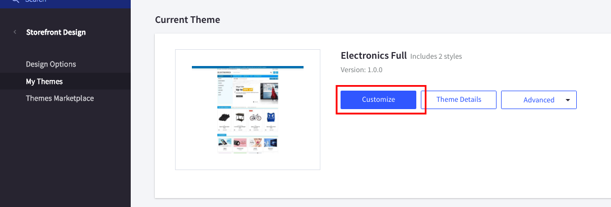

Look into the options showing below:


## Header

### Header Styles
This theme support 2 different header styles:
- Logo at left
- Logo at right

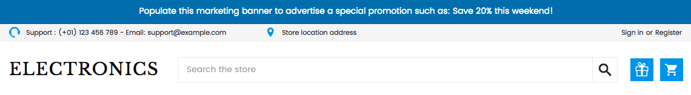

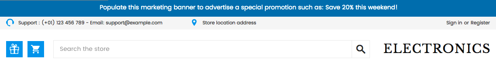

To configure, open the __Theme Editor__, scroll down to section __Logo__, click to expand the logo options. Choose a certain option of __Logo position__, then click __Refresh__ button appear after.

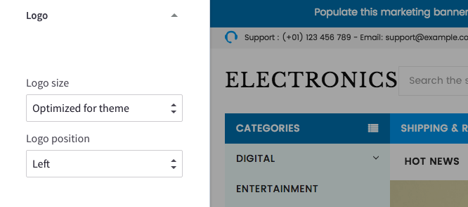

### Edit top header text
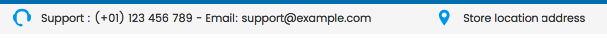

Edit content in the language file, from admin page > __Storefront Design__ > __My Themes__, click button __Advanced__ > __Edit Theme Files__ of the current theme:

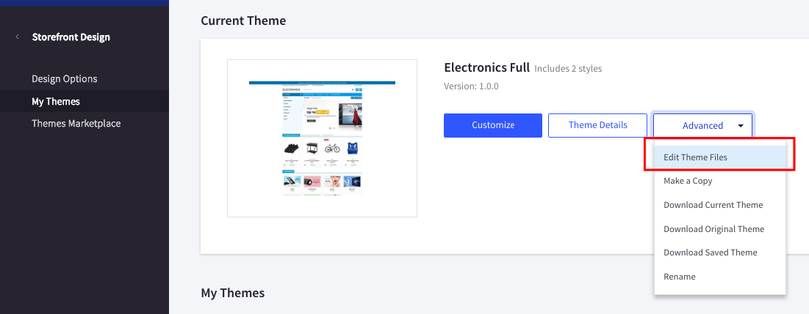

From the left navigation, click to edit the language file (e.i `en.json`):


Edit the text as figured above.


### Colors Customization

To customize colors of the header section, look into the options showing below in the Theme Editor:


## Hot News

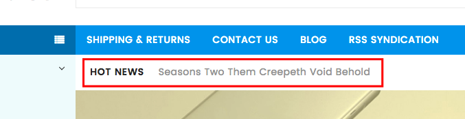

This section automatically shows heading of latest posts from your blog.

You can edit or remove this section in template file `templates/pages/home.html`:

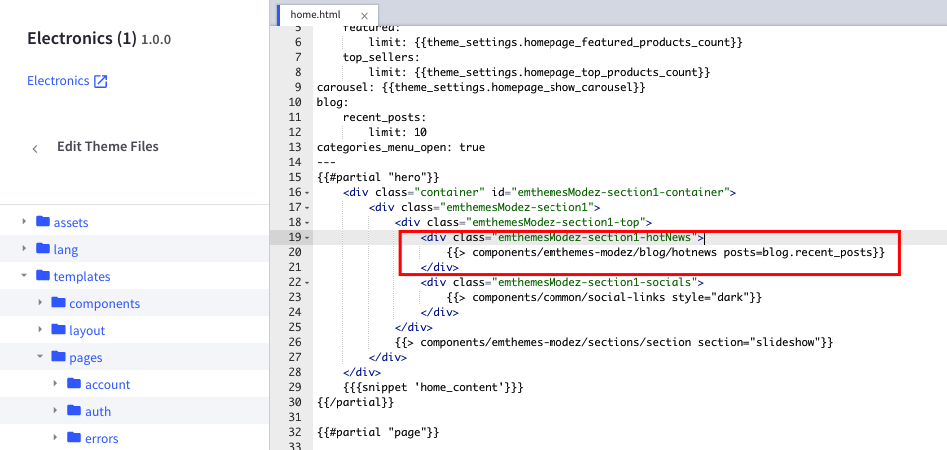


## Social Icons

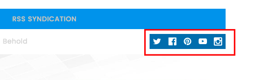

Drag and drop social media icons you want to display in admin page > __Storefront Design__ > __Design Options__:


You can remove this section by editing template file `templates/pages/home.html`:

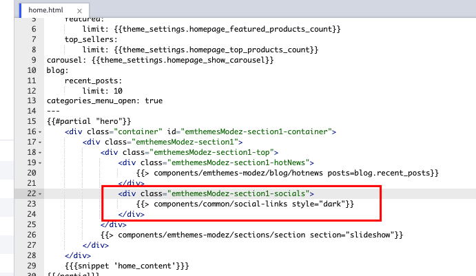


## Main Slideshow / Carousel

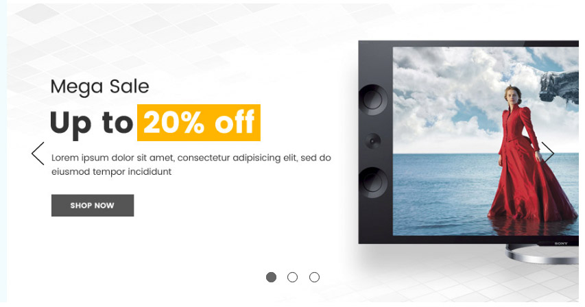

### Edit the slideshow

Edit the slideshow in admin page > __Storefront Design__ > __Design Options__:


### Colors Customization

To customize color of the slideshow's elements, look into section __Carousel__ in the Theme Editor:


### Hide the slideshow

To hide the slideshow on homepage, uncheck on the checkbox __Show Carousel__ in section __Carousel__ of the Theme Editor.


## New / Featured / Popular Products

The theme supports 4 layout type of __New Products__, __Featured Products__ and __Popular Products__ blocks:

__Grid__:

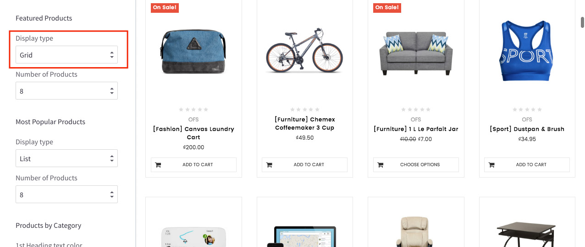

__Carousel__:

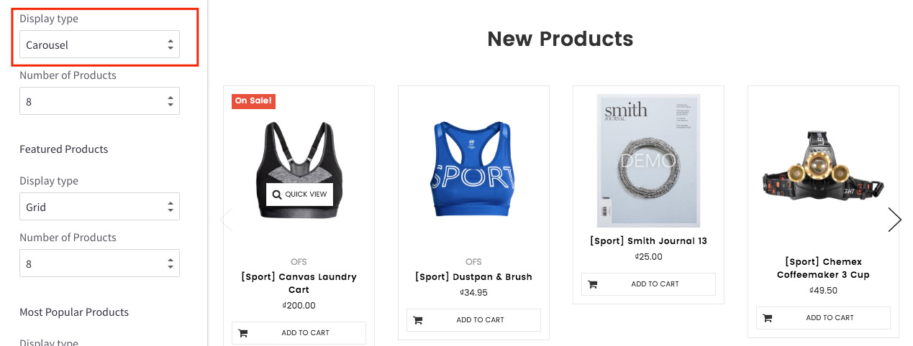

__List__:

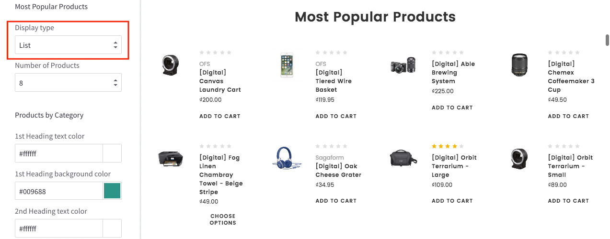


### Configure a Layout Type of products block & Number of Products to show up

In the __Theme Editor__ > __Homepage__, look into __New Products__ section (or __Featured Products__, __Most Popular Products__):

- __Display type__: Choose appropriate layout type (__Grid__, __Carousel__, __Left Column__ or __Right Column__).
- __Number of Products__: Choose number of products to show up.


### Show/Hide Quickview button

When hover on a product item, Quickview button is showed up by default. To disable this feature, uncheck the checkbox __Show Quickview__ in the __Theme Editor__ > __Products__ section.


### Change colors and image sizes

In the __Theme Editor__ > __Products__ section, Look into the color options below __Product cards__, __Product Sale Badges__, __Product cards (Quick search)__ and __Image sizes__'s options.


### Change the heading text

To change the heading text (New Products, Featured Products, Most Popular Products), edit the language file, look for the key `products` > `new` or `featured` or `top`.


## New / Featured / Popular Products Tabs

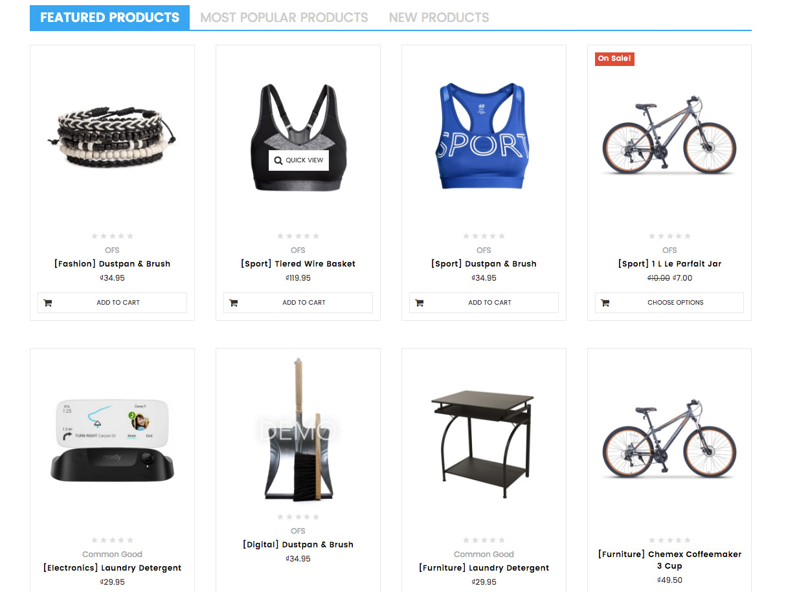

This section allows you to display __new products__, __featured products__, and __bestselling products__ in tabs. Products can be displayed as grid, list or carousel depend on configuration in the Theme Editor.


## Categories List

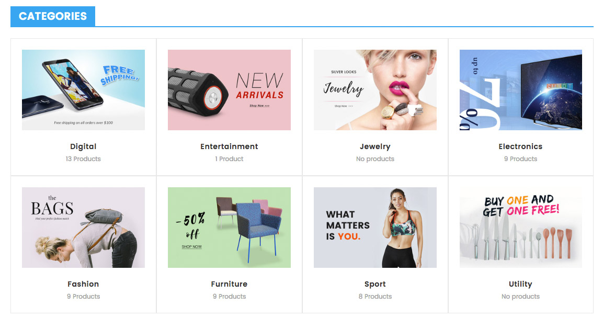

This section lets you show categories list, category images and number of products per category.

To edit text of this section, edit the language file `en.json`, find key `emthemesmodez` > `categories_grid`:


- `heading`: is section title.
- `products_count`: is the translation text showing number of products in category.


## Products by Category


This section displays products in a specific category. You can display this section type up to 3 sections, represent 3 different categories.

To specify which category to display, edit the language file `en.json`, find keys `emthemesmodez` > `products_by_category`:

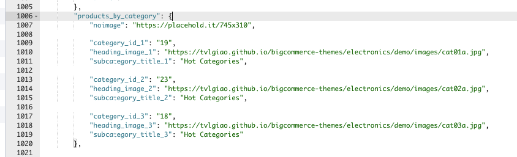

- `category_id_1` to `category_id_3`: represent category ID of products of 3 section instances.
- `heading_image_1` to `heading_image_3`: is image URLs above Hot Categories.
- `subcategory_title_1` to `subcategory_title_3`: is custom heading text of subcategories list.

The large image is  category image.

To find category ID of a certain category, go to admin page > __Products__ > __Product Categories__, click on a category to edit. Now look at the URL on your browser, the ID is appear in the URL as showing below:


## Products by Category with sorting tabs

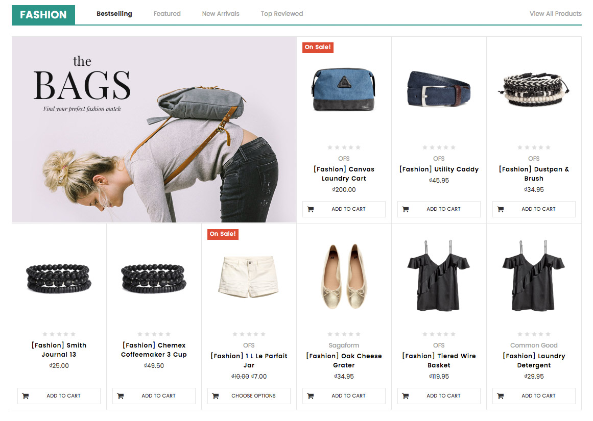

This section displays products in a specific category. The tabs let you sorting products by bestselling, featured, new products and top reviewed. You can display this section type up to 3 sections, represent 3 different categories.

To specify which category to display, edit the language file `en.json`, find keys `emthemesmodez` > `products_by_category_sorting_tabs`:

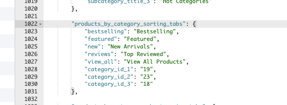

- `bestselling`, `featured`, `new`, `reviews`: are tab title for sorting products by bestselling, fatured, new and top reviewed.
- `view_all`: is text of view all products link.
- `category_id_1` to `category_id_3`: is category ID of each section instance.


## Products by Category with subcategory tabs

__Root category:__

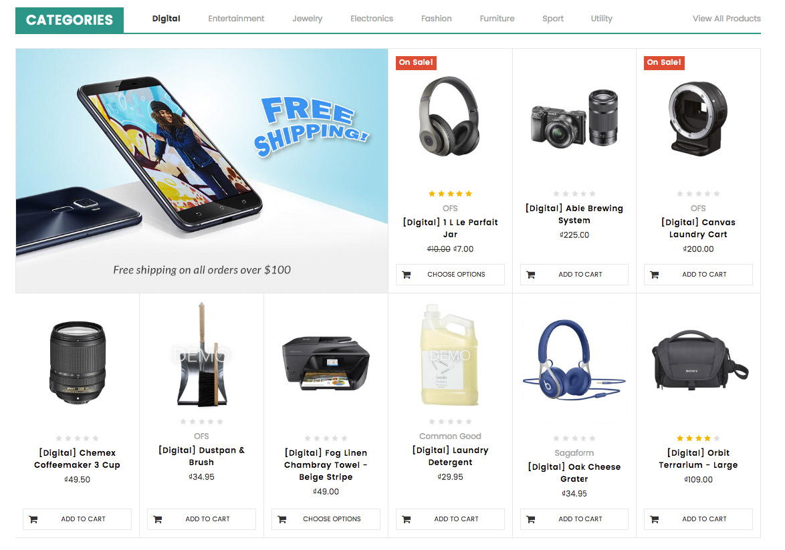

__Sub category:__

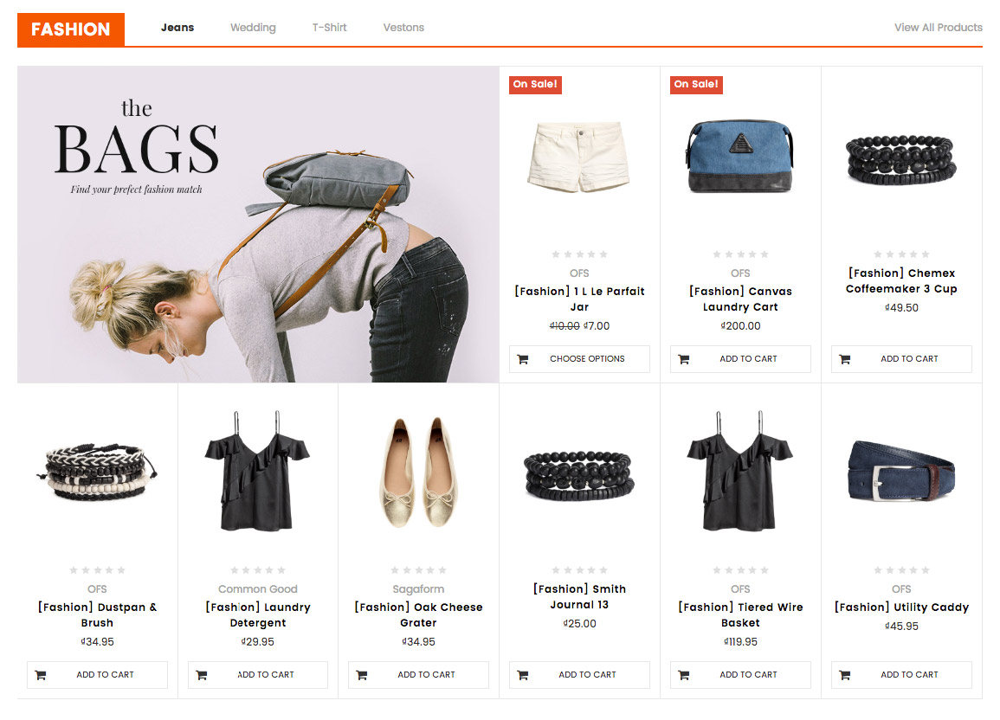

This section displays products in a specific category. The tabs let you sorting products by bestselling, featured, new products and top reviewed. You can display this section type up to 3 sections, represent 3 different categories.

To specify which category to display, edit the language file `en.json`, find keys `emthemesmodez` > `products_by_category_subcategories_tabs`:

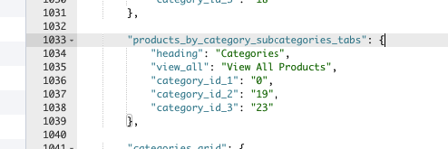

- `heading`: is the heading text to display if category is root.
- `view_all`: is text of view all products link.
- `category_id_1` to `category_id_3`: is category ID of each section instance. Set value = `0` to display root category.


## Image Banners

Theme supports many banner styles:

### Fullwidth Banner
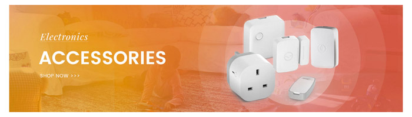

Support displaying up to 5 fullwidth banners on homepage.

To edit these banners, edit the language file `en.json`, find keys `emthemesmodez` > `banners` > `one_1` to `one_3` represent 3 fullwidth banners accordingly.


- `title`: is banner title text. Leave a single space character to hide it.
- `text`: is description text. Leave a single space character to hide it.
- `button`: is button text. Leave a single space character to hide it.
- `image`: is banner image URL.
- `url`: is banner link.


### 2 Half Banners


Support displaying up to 3 half-size banners on homepage.

To edit these banners, edit the language file `en.json`, find keys `emthemesmodez` > `banners` > `half_1` to `half_3` represent 3 fullwidth banners accordingly.


### 2/3 & 1/3 Banners


Support displaying up to 3 half-size banners on homepage.

To edit these banners, edit the language file `en.json`, find keys `emthemesmodez` > `banners` > `twothird_onethird_1` to `twothird_onethird_3` represent 3 fullwidth banners accordingly.


### 3 Banners

__Default style:__

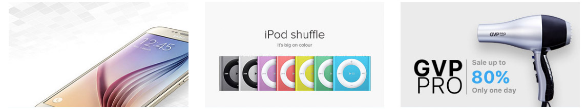


__Boxed style:__

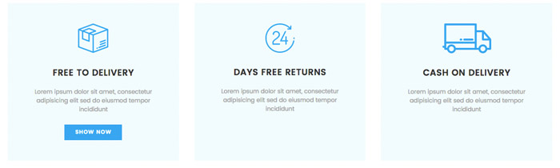


Support displaying up to 3 half-size banners on homepage.

To edit these banners, edit the language file `en.json`, find keys `emthemesmodez` > `banners` > `onethird_x3_1` to `onethird_x3_3` represent 3 fullwidth banners accordingly.


## Image Carousel


To edit image and links in this image carousel section, edit the language file, find key `emthemesmodez` > `image_carousel`


- `image*`: is link to the image.
- `title*`: is image text description.
- `url*`: is image link. Leave a single space letter in the value if you want to hide any image.


## Footer - About Us

Show or hide this section in Theme Editor > __Footer__ section:

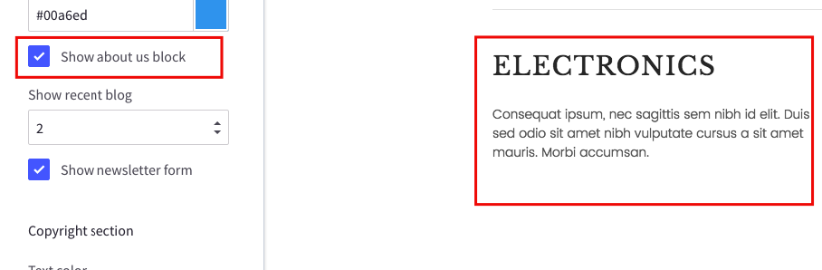

You can customize text in the language file `en.json`:

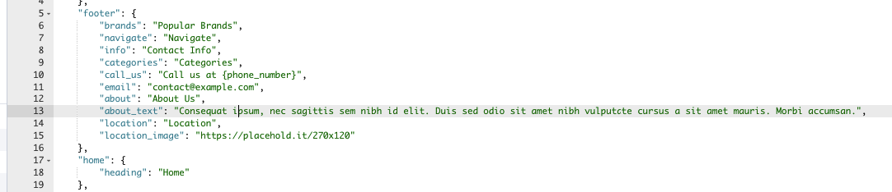


## Footer - Recent Posts

Show, hide or configure number of post items to display in Theme Editor > __Footer__ section:

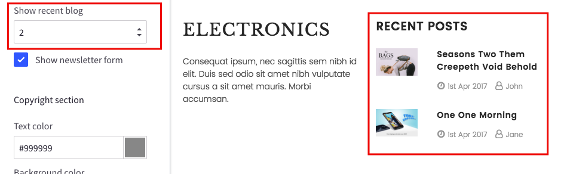

To change the heading text, read more text and date format, edit the language file. Find the key `blog` > `recent_posts`, `posted_by` and `label`, edit its values as you want.

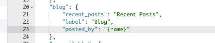


## Footer - Newsletter Form

Show or hide this section in Theme Editor > __Footer__ section:

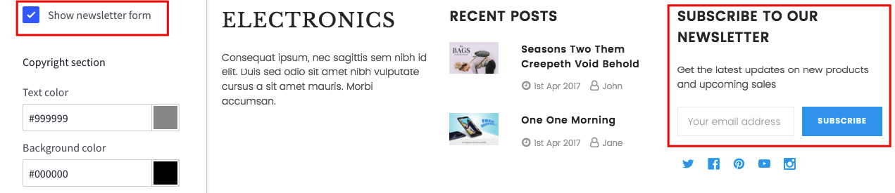

To edit text in newsletter form, edit the language file `en.json`, find key `newsletter`, edit text in this section:


## Footer - Social media icons

Show or hide social media icons in Theme Editor > __Social media icons__ section:

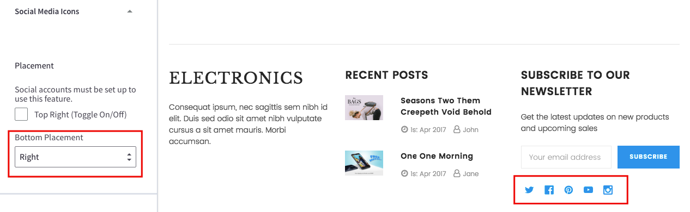

Drag and drop social media icons you want to display in admin page > __Storefront Design__ > __Design Options__:


## Footer - Custom Links

Show or hide custom link groups in Theme Editor > __Footer__ section:

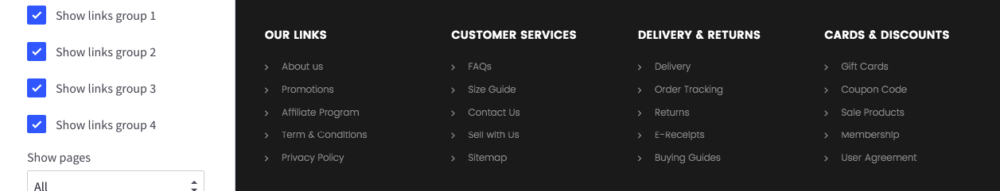

To edit text and links in this footer section, edit the language file, find keys `footer`, 4 keys `links_col_1`, `links_col_2`, `links_col_3`, `links_col_4` represent 4 link columns:


- `heading`: is heading title in each column.
- `title`: is link label. Leave a single space character to hide this link.
- `url`: is link URL.


## Footer - Page Links

Show, hide or configure number of page links in footer in Theme Editor > __Footer__ section:

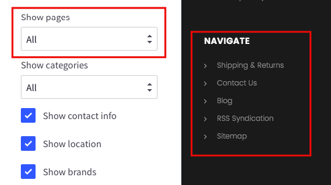

This section will show all our page links. To change the heading text __Navigate__, edit the language file `en.json`, find key `footer` > `navigate`, change this key value:


## Footer - Category Links

Show, hide or configure number of category links in footer in Theme Editor > __Footer__ section:

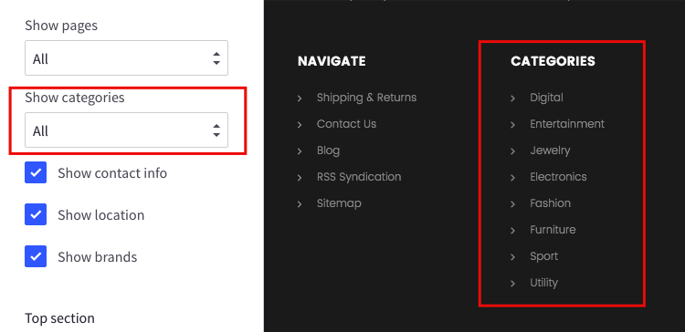

Edit heading text __Categories__ in the language file `en.json`, find key `footer` > `categories`:


## Footer - Contact Info

Show or hide this section in Theme Editor > __Footer__ section:

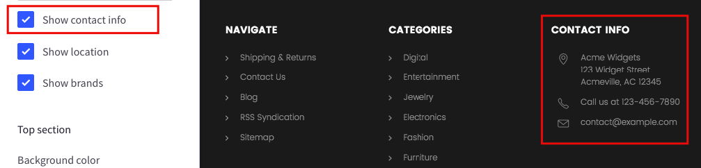

Edit heading text __Contact Info__ in the language file `en.json`, find key `footer` > `info`:


- `call_us`: is the translation text for phone calling number.
- `email`: is email to display.

Address can be edited in admin page > __Store Setup__ > __Store Profile__ > __Store Address__.


## Footer - Location

Show or hide this section in Theme Editor > __Footer__ section:

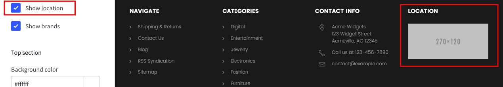

Edit heading text __Contact Info__ and the image in the language file `en.json`, find key `footer`, change value of `location` and `location_image`:


## Footer - Popular Brands

Show or hide this section in Theme Editor > __Footer__ section:

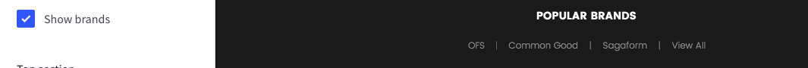

Edit heading text __Popular Brands__ in the language file `en.json`, find key `footer` > `brands`:


## Footer - Payment Icons

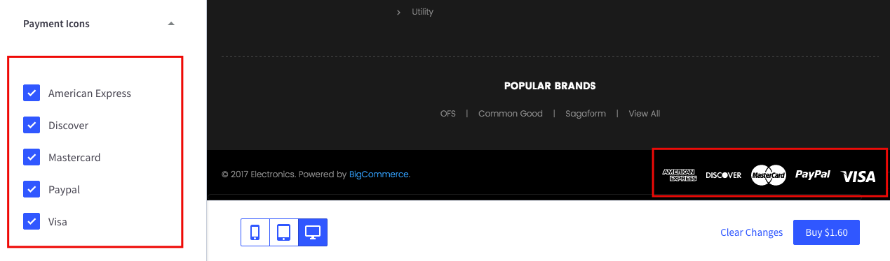

To show/hide payment icons, go to Theme __Editor__ > __Payment Icons__ secitons, check or uncheck any icons you want to show or hide.


## Footer - Credit Links


To show/hide the credit links, go to Theme Editor > __Footer__ section, tick or untick the checkboxes as showing above.


## Customize footer colors

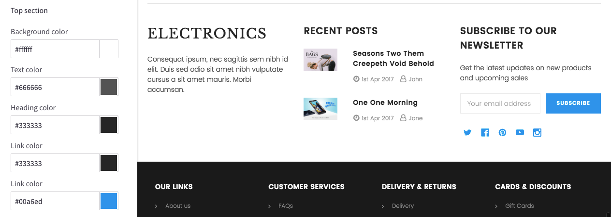

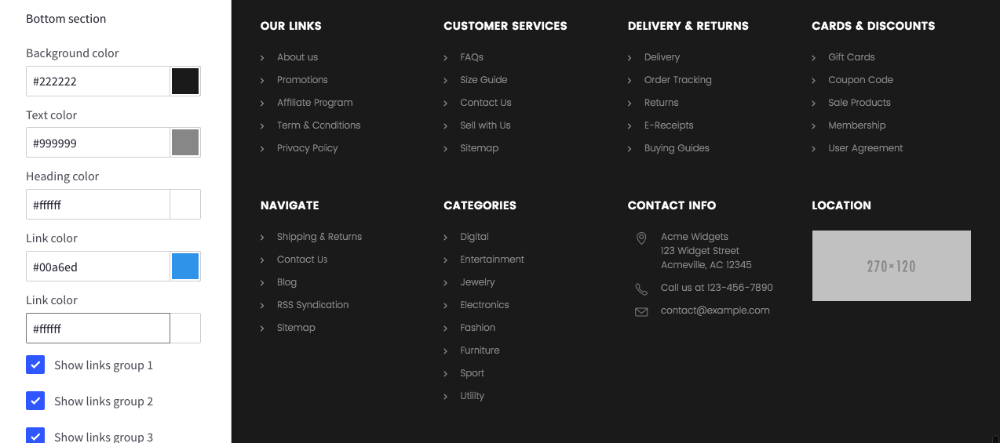


## Edit homepage template

This chapter will instruct you how to customize homepage layouts, show, hide or rearrange sections from different theme styles.

For example, if you want to use theme __Default__ style as the main theme, but also want to display other content blocks from __Full__ style. You can edit the template files, rearrange, add more content blocks or delete unused content blocks.

Let open folder `templates` > `components` > `emthemes-modez` > `home` in the template files editor:

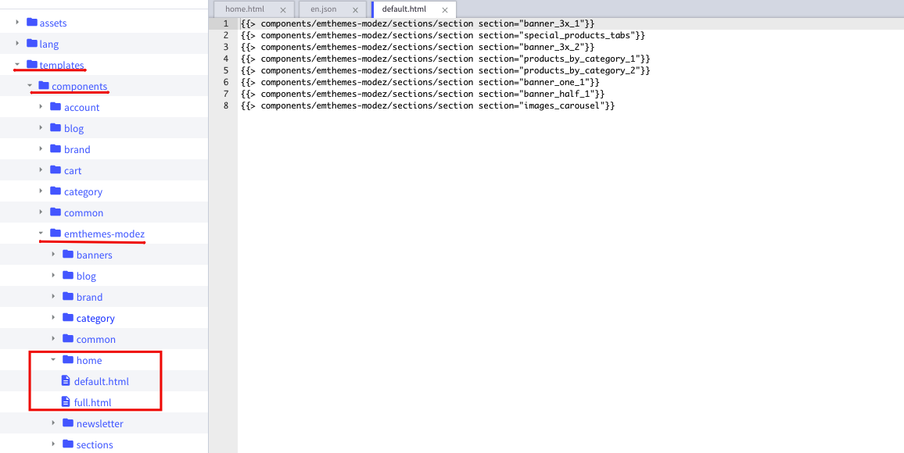

There is 2 files in this folder:

- `default.html`: is used for __Default__ style.
- `full.html`: is used for __Full__ style.

Let's take a look at contents of 2 files:

__default.html__

```plain
{{> components/emthemes-modez/sections/section section="banner_3x_1"}}
{{> components/emthemes-modez/sections/section section="special_products_tabs"}}
{{> components/emthemes-modez/sections/section section="banner_3x_2"}}
{{> components/emthemes-modez/sections/section section="products_by_category_1"}}
{{> components/emthemes-modez/sections/section section="products_by_category_2"}}
{{> components/emthemes-modez/sections/section section="banner_one_1"}}
{{> components/emthemes-modez/sections/section section="banner_half_1"}}
{{> components/emthemes-modez/sections/section section="images_carousel"}}
```

__full.html__

```plain
{{> components/emthemes-modez/sections/section section="new_products"}}
{{> components/emthemes-modez/sections/section section="featured_products"}}
{{> components/emthemes-modez/sections/section section="popular_products"}}
{{> components/emthemes-modez/sections/section section="special_products_tabs"}}
{{> components/emthemes-modez/sections/section section="categories_grid"}}
{{> components/emthemes-modez/sections/section section="banner_3x_1"}}
{{> components/emthemes-modez/sections/section section="products_by_category_1"}}
{{> components/emthemes-modez/sections/section section="products_by_category_2"}}
{{> components/emthemes-modez/sections/section section="products_by_category_3"}}
{{> components/emthemes-modez/sections/section section="banner_3x_2"}}
{{> components/emthemes-modez/sections/section section="products_by_category_sorting_tabs_1"}}
{{> components/emthemes-modez/sections/section section="products_by_category_sorting_tabs_2"}}
{{> components/emthemes-modez/sections/section section="products_by_category_sorting_tabs_3"}}
{{> components/emthemes-modez/sections/section section="banner_one_1"}}
{{> components/emthemes-modez/sections/section section="products_by_category_subcategories_tabs_1"}}
{{> components/emthemes-modez/sections/section section="products_by_category_subcategories_tabs_2"}}
{{> components/emthemes-modez/sections/section section="products_by_category_subcategories_tabs_3"}}
{{> components/emthemes-modez/sections/section section="banner_half_1"}}
{{> components/emthemes-modez/sections/section section="images_carousel"}}

```

The files are showing very clearly how content blocks are displayed. See values in parameter `section="..."`:

- `new_products`: Is a block contains new products.
- `featured_products`: Is a block contains new featured products.
- `popular_products`: Is a block contains popular (or bestselling) products.
- `special_products_tabs`: Show new products, featured products and bestselling products in tabs.
- `categories_grid`: Showing categories list with image and number of products in grid.
- `banner_3x_1`, `banner_3x_2`, `banner_3x_3`: 3 banner blocks show 3 banner images of each block.
- `banner_one_1`, `banner_one_2`, `banner_one_3`: 3 banner blocks show fullwidth banner image of each block.
- `banner_half_1`, `banner_half_2`, `banner_half_3`: 3 banner blocks show 2 banner images of each block.
- `products_by_category_1`, `products_by_category_2`, `products_by_category_3`: 3 blocks display products by specific category.
- `products_by_category_sorting_tabs_1`, `products_by_category_sorting_tabs_2`, `products_by_category_sorting_tabs_3`: 3 blocks display products by specific category with tabs allow to sort products by bestselling, new products, featured products and top reviewed.
- `products_by_category_subcategories_tabs_1`, `products_by_category_subcategories_tabs_2`, `products_by_category_subcategories_tabs_3`: 3 blocks display products by specific category with subcategory filter in tabs.
- `images_carousel`: Lets you show images in carousel slider.


You can add or delete any section you want, rerrange by move each line up or down.


## Edit footer template

If you want more control about the footer, you can edit the footer template at `templates` > `components` > `common` > `footer.html`:


